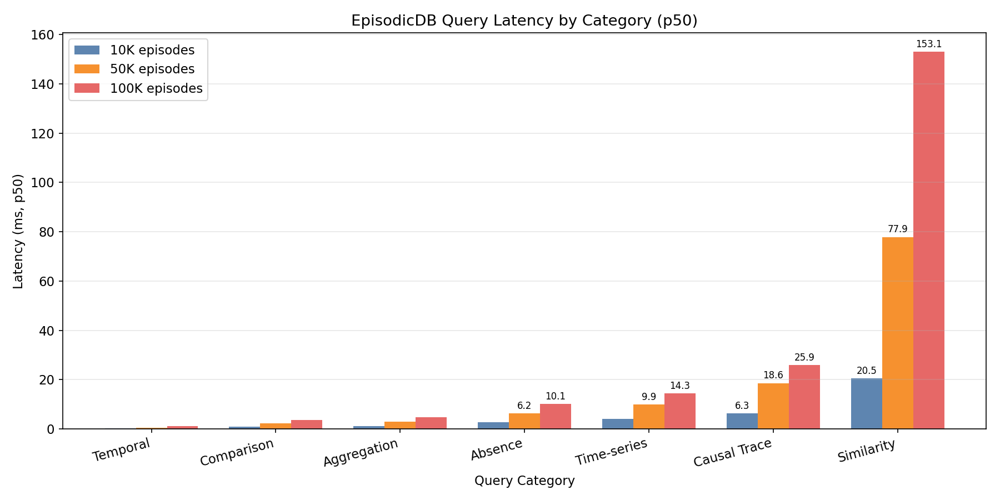
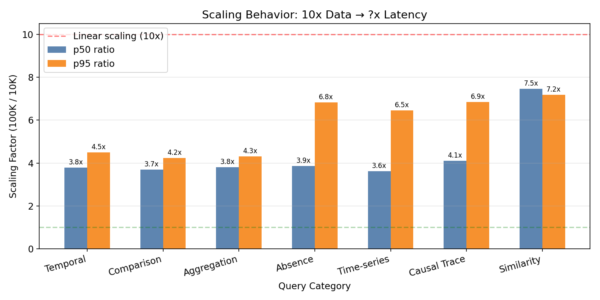
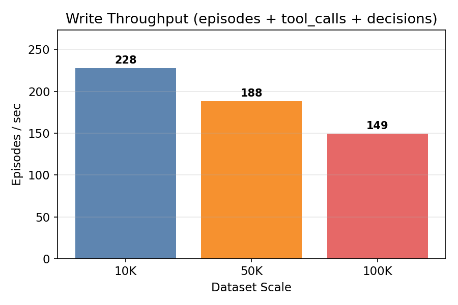

# EpisodicDB

**An OLAP-based memory engine for AI agents.**

Existing agent memory systems (Mem0, Zep, Letta) are designed as *search systems*. EpisodicDB treats agent memory as an *analytics problem* — aggregation, time-series patterns, causal tracing, temporal facts, and vector similarity all in a single query engine.

```sql
-- "Which tools failed most this week?"
SELECT tool_name, COUNT(*) AS failures
FROM tool_calls
WHERE outcome = 'failure'
  AND called_at >= NOW() - INTERVAL '7 days'
GROUP BY tool_name
ORDER BY failures DESC;

-- "Find past episodes similar to this context that succeeded"
SELECT *, array_cosine_distance(context_embedding, ?) AS dist
FROM episodes
WHERE status = 'success'
ORDER BY dist ASC
LIMIT 5;
```

## The Problem

| Query type | Example | Vector search? |
|------------|---------|----------------|
| Similarity | "Seen a similar error before?" | Yes |
| Aggregation | "How many tool failures this week?" | No |
| Time-series | "Do failures spike in the afternoon?" | No |
| Causal trace | "What tool ran right before failures?" | No |
| Comparison | "Worse than last week?" | No |
| Absence | "Tools that never succeeded?" | No |
| Temporal | "What was the user's timezone last Tuesday?" | No |

EpisodicDB answers all of them. Vector similarity is just another SQL operator.

## Architecture

```
EpisodicDB
├── WriterMixin      record_episode / record_tool_call / record_decision / record_fact
├── AnalyticsMixin   6 analytics methods + vector similarity
└── TemporalMixin    facts_as_of / fact_history

Engine: DuckDB (OLAP) + VSS extension (HNSW vector index)
Schema: episodes + tool_calls + decisions + facts
```

## Install

```bash
pip install episodicdb
```

## Quick Start

### Python SDK

```python
from episodicdb import EpisodicDB

with EpisodicDB(agent_id="my-agent") as db:
    # Record what happened
    ep_id = db.record_episode(
        status="failure",
        task_type="file_edit",
        context={"file": "auth.py", "error": "permission denied"},
    )
    db.record_tool_call(ep_id, "Edit", "failure",
                        duration_ms=120, error_message="permission denied")
    db.record_tool_call(ep_id, "Bash", "success", duration_ms=50)

    # Record temporal facts (auto-supersedes previous values)
    db.record_fact("user_timezone", "Asia/Seoul", episode_id=ep_id)
    db.record_fact("user_timezone", "America/New_York")  # closes previous

    # Analyze patterns
    print(db.top_failing_tools(days=7))
    # [{"tool_name": "Edit", "failures": 5}, ...]

    print(db.before_failure_sequence("Edit"))
    # [{"prev_tool": "Bash", "count": 4}, ...]

    print(db.compare_periods("failure_rate", days=7))
    # {"period_a": 0.32, "period_b": 0.18, "delta": 0.14}

    # Time-travel query
    from datetime import datetime
    print(db.facts_as_of(datetime(2025, 3, 15)))
    # [{"key": "user_timezone", "value": "Asia/Seoul", ...}]
```

### MCP Server (Claude, OpenAI Agents SDK)

EpisodicDB ships an MCP server with 12 tools over stdio.

```bash
episodicdb-mcp --agent-id my-agent
episodicdb-mcp --agent-id my-agent --db ./memory.db
```

**Claude Desktop** (`claude_desktop_config.json`):

```json
{
  "mcpServers": {
    "episodicdb": {
      "command": "episodicdb-mcp",
      "args": ["--agent-id", "my-agent"]
    }
  }
}
```

**Claude Code**:

```bash
claude mcp add --scope user episodicdb -- episodicdb-mcp --agent-id my-agent --client-type claude-code --daemon
```

**OpenAI Agents SDK**:

```python
from agents import Agent
from agents.mcp import MCPServerStdio

agent = Agent(
    name="my-agent",
    instructions="You have access to episodic memory.",
    mcp_servers=[MCPServerStdio(
        command="episodicdb-mcp",
        args=["--agent-id", "my-agent"],
    )],
)
```

### Daemon Mode (multi-session)

DuckDB has a single-writer lock. If you run multiple MCP clients (e.g. several Claude Code sessions), use `--daemon` so a single process owns the DB and clients route through HTTP:

```bash
# CLI flag — the MCP server auto-starts a daemon on localhost
episodicdb-mcp --agent-id my-agent --daemon

# Or run the daemon manually
python -m episodicdb.daemon --agent-id my-agent --port 7823
```

```python
# Python SDK equivalent
from episodicdb import EpisodicDBClient

client = EpisodicDBClient(agent_id="my-agent")  # auto-starts daemon
client.record_episode(status="success", task_type="coding")
```

### Auto-recording (recommended)

Add these rules to your `CLAUDE.md` (or system prompt) so the agent records episodes automatically:

```markdown
## EpisodicDB — auto-recording rules

EpisodicDB MCP server is connected. Follow these rules to record work automatically.

### On session start
- Call `record_episode` (status: "partial", task_type: type of work)
- Remember the episode ID for subsequent tool call / decision records

### During work
- Record significant tool results with `record_tool_call` (success/failure, duration)
- Record important decisions with `record_decision` (rationale, alternatives)
- Record new user/project facts with `record_fact` (e.g. preferred_language, current_project)

### On session end
- Update the episode status to match the final outcome (success/failure/partial/aborted)

### Guidelines
- Don't interrupt the user's workflow to record — do it in the background
- Only record meaningful actions, not every small step
- Use english snake_case for fact keys (e.g. preferred_language, deploy_target)
```

## API

### Writer

```python
db.record_episode(status, task_type=None, context=None,
                  embedding=None, tags=None,
                  started_at=None, ended_at=None) -> str  # episode UUID

db.record_tool_call(episode_id, tool_name, outcome,
                    parameters=None, result=None,
                    duration_ms=None, error_message=None) -> str

db.record_decision(episode_id, rationale,
                   decision_type=None, alternatives=None,
                   outcome=None) -> str

db.record_fact(key, value, episode_id=None,
               valid_from=None) -> str  # auto-supersedes previous
```

### Analytics

| Method | Description |
|--------|-------------|
| `top_failing_tools(days, limit)` | Most-failed tools in the last N days |
| `hourly_failure_rate(days)` | Failure count by hour of day |
| `before_failure_sequence(tool_name, lookback)` | Tools that precede failures |
| `compare_periods(metric, days)` | Period-over-period comparison |
| `never_succeeded_tools()` | Tools with zero successful calls |
| `similar_episodes(embedding, status, limit)` | Vector similarity + SQL filter |

### Temporal Facts

Facts are key-value pairs with automatic temporal validity. Recording a new value for the same key closes the previous one.

```python
db.record_fact("preferred_model", "gpt-4o")
# later...
db.record_fact("preferred_model", "claude-sonnet")  # supersedes gpt-4o

db.facts_as_of(some_datetime)   # point-in-time snapshot
db.fact_history("preferred_model")  # full change log
```

### Persistence

```python
EpisodicDB(agent_id="my-agent")                    # ~/.episodicdb/my-agent.db
EpisodicDB(agent_id="my-agent", path="./x.db")    # explicit path
EpisodicDB(agent_id="my-agent", path=":memory:")  # in-memory (testing)
```

### Embeddings & Similar Episodes

`similar_episodes` uses vector similarity to find past episodes. The flow:

1. **Record** — embed the context when recording an episode
2. **Search** — embed the query and call `similar_episodes`

Built-in helpers for popular providers (lazy imports, no hard dependencies):

```bash
pip install episodicdb[openai]   # OpenAI
pip install episodicdb[voyage]   # Voyage AI
pip install episodicdb[ollama]   # Ollama (local)
pip install episodicdb[all]      # all providers
```

```python
from episodicdb import EpisodicDB, embeddings

db = EpisodicDB(agent_id="my-agent")

# 1. Record with embedding
vec = embeddings.openai("editing auth.py, got permission denied")
db.record_episode(
    status="failure",
    task_type="file_edit",
    context={"file": "auth.py", "error": "permission denied"},
    embedding=vec,
)

# 2. Later — find similar past episodes
query_vec = embeddings.openai("permission error when modifying files")
results = db.similar_episodes(query_vec, status="failure", limit=5)
# [{"id": "...", "context": {...}, "distance": 0.12, ...}, ...]
```

Or bring your own embedding function (must produce 1536-dim vectors):

```python
db.record_episode(status="success", embedding=your_1536_dim_list)
db.similar_episodes(your_query_vector, limit=5)
```

> **Note:** EpisodicDB stores and searches vectors — it does not generate embeddings. The caller is responsible for calling an embedding API. This keeps the core dependency-free.

## Benchmarks

EpisodicDB ships a built-in benchmark suite covering 7 query categories across 10K–100K episodes. All numbers below were measured on Apple M3 Pro, DuckDB 1.4.3, Python 3.13.

### Query Latency



| Category | 10K p50 | 50K p50 | 100K p50 | What it measures |
|----------|---------|---------|----------|-----------------|
| Temporal | 0.28ms | 0.58ms | 1.08ms | Point-in-time fact snapshots, change history |
| Comparison | 0.96ms | 2.23ms | 3.54ms | Period-over-period deltas (failure rate, counts) |
| Aggregation | 1.23ms | 2.88ms | 4.70ms | GROUP BY analytics (top failing tools) |
| Absence | 2.62ms | 6.23ms | 10.12ms | Anti-join (tools that never succeeded) |
| Time-series | 3.96ms | 9.94ms | 14.34ms | Hourly bucketed failure patterns |
| Causal trace | 6.33ms | 18.58ms | 25.94ms | LAG window functions (what preceded failures) |
| **Similarity** | **20.51ms** | **77.87ms** | **153.09ms** | **Vector cosine distance (HNSW index)** |

All SQL-based queries stay under 26ms at 100K episodes. Vector similarity is the bottleneck — and the reason Phase 2 exists.

### Scaling Behavior



With 10x more data (10K → 100K episodes):
- **SQL queries scale 3.6–4.1x** — sub-linear, DuckDB's columnar engine shines
- **Vector similarity scales 7.5x** — HNSW index bypassed when combined with WHERE clause ([#2](https://github.com/KsPsD/EpisodicDB/issues/2))

This is the core finding: SQL analytics are already fast enough. The hybrid query path (SQL filter + vector search) is where optimization matters.

### Write Throughput



Each "episode" includes ~4.5 tool calls and ~1.5 decisions. At 100K scale, write throughput is 149 composite records/sec — more than enough for agent memory workloads where writes are human-interaction-paced.

### Run it yourself

```bash
git clone https://github.com/KsPsD/EpisodicDB && cd EpisodicDB
pip install -e ".[dev]" && pip install matplotlib

python -m benchmarks.run_benchmark                          # 10K (default)
python -m benchmarks.run_benchmark --scale 10000 50000 100000  # multi-scale
python -m benchmarks.visualize                               # generate charts
```

## Roadmap

### Phase 1: DuckDB Prototype — **Complete** (v0.1.6)

Core OLAP engine, MCP server, daemon mode, temporal facts, embeddings. Everything in this README works today.

### Phase 2: Custom Hybrid Query Planner — Next

The benchmark shows that SQL queries scale sub-linearly, but vector similarity degrades near-linearly because DuckDB's VSS extension can't combine HNSW index scans with SQL predicates in a single execution plan ([#2](https://github.com/KsPsD/EpisodicDB/issues/2), [#4](https://github.com/KsPsD/EpisodicDB/issues/4)).

Phase 2 adds a query planner layer that:
1. Estimates predicate selectivity before execution
2. Chooses filter-first vs vector-first strategy based on cost
3. Uses a filtered vector index (ACORN-style) for the hybrid path

Goal: bring similarity scaling from 7.5x → sub-linear, matching the SQL queries.

## Development

```bash
git clone https://github.com/KsPsD/EpisodicDB
cd EpisodicDB
pip install -e ".[dev]"
pytest
```

## Stack

- [DuckDB](https://duckdb.org/) — embedded OLAP engine
- [DuckDB VSS](https://duckdb.org/docs/extensions/vss) — HNSW vector index
- [MCP](https://modelcontextprotocol.io/) — Model Context Protocol server
- Python 3.11+

## License

MIT
